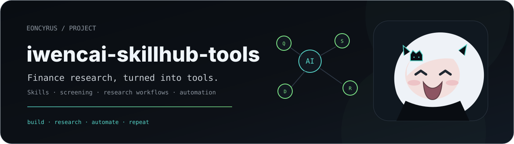

<p align="center">
  <picture>
    <source media="(prefers-color-scheme: dark)" srcset="./assets/hero-dark.svg">
    <source media="(prefers-color-scheme: light)" srcset="./assets/hero-light.svg">
    
  </picture>
</p>

<p align="center"><sub>同花顺 Aime SkillHub 工具集 · 技能批量安装 · 金融研究工作流</sub></p>

## 功能特性

- 官方技能与第三方技能分类安装
- 交互式 IWENCAI API Key 配置
- 按业务场景分类（数据查询、选股、建模、并购等）
- 支持 AI 调用批量安装
- Bash / Python 双版本支持

## 项目结构

```
skillhub-tools/
├── README.md                      # 使用文档
├── install_skills.sh              # Bash 批量安装脚本
└── skillhub-batch-install/
    ├── SKILL.md                   # AI Skill 定义 (可直接安装使用)
    └── cli.py                     # Python CLI (AI 可调用)
```

## 快速开始

### 1. 安装 SkillHub CLI

```bash
curl -fsSL https://www.iwencai.com/skillhub/static/0.0.3/download_and_install.sh | bash
```

### 2. 克隆项目

```bash
git clone https://github.com/eoncyrus-lab/iwencai-skillhub-tools.git
cd iwencai-skillhub-tools
chmod +x install_skills.sh
```

### 3. 安装技能

```bash
# 方式一：Bash 脚本
./install_skills.sh official     # 官方技能（自动配置环境变量）
./install_skills.sh third-party  # 第三方技能
./install_skills.sh all           # 所有技能
./install_skills.sh data-query     # 按场景安装

# 方式二：Python CLI（推荐 AI 使用）
cd skillhub-batch-install
python3 cli.py list               # 列出分类
python3 cli.py install OFFICIAL  # 安装官方技能
python3 cli.py install-all       # 安装所有技能
python3 cli.py setup-env         # 配置环境变量
```

### 4. 安装 AI Skill（让 AI 可以帮你安装）

```bash
aime-skillhub-cli install 批量安装AimeSkillHub技能
```

安装后可直接告诉 AI："帮我安装所有官方技能"

## 分类说明

### 顶层分类

| 分类 | 数量 | 说明 |
|------|------|------|
| `official` | 27 | 官方技能，需配置 IWENCAI 环境变量 |
| `third-party` | 77 | 第三方技能，无需额外配置 |
| `all` | 104 | 所有技能 |

### 业务场景分类

| 分类 | 数量 | 说明 |
|------|------|------|
| `data-query` | 16 | 数据查询（行情、财务、宏观、行业等） |
| `screener` | 10 | 选股筛选（A股、港股、美股、ETF、基金等） |
| `analysis` | 12 | 分析工具（因子、情绪、估值、财报体检等） |
| `modeling` | 6 | 财务建模（DCF、并购、LBO、三表等） |
| `mna` | 14 | 并购类（CIM、尽调、买方清单等） |
| `philosophy` | 7 | 投资理念（利弗莫尔、桥水、巴菲特等） |
| `reports` | 5 | 研究报告 |
| `tools` | 9 | 工具类（PPT、尽调清单等） |
| `trading` | 4 | 交易与组合 |
| `fixed-income` | 4 | 固定收益 |
| `fx-deriv` | 4 | 外汇与衍生品 |
| `wealth` | 3 | 财富管理 |
| `pe` | 2 | 私募股权 |
| `fintech` | 3 | 金融科技 |

## IWENCAI 环境变量配置

### 自动配置（推荐）

```bash
./install_skills.sh official
# 或
python3 skillhub-batch-install/cli.py setup-env
```

脚本会提示：
1. 访问 https://www.iwencai.com/skillhub 登录
2. 点击任意一个官方技能卡片，页面会显示环境变量
3. 输入 API Key 和 BASE URL
4. 自动写入 `~/.zshrc`

### 手动配置

```bash
vim ~/.zshrc
# 添加以下内容
export IWENCAI_BASE_URL=https://openapi.iwencai.com
export IWENCAI_API_KEY=你的APIKey

source ~/.zshrc
```

## AI 使用指南

### 安装 AI Skill

```bash
aime-skillhub-cli install 批量安装AimeSkillHub技能
```

### 使用方式

安装后可直接对话：

- "帮我安装所有官方技能"
- "安装数据查询类和选股筛选类"
- "安装并购相关的技能"
- "配置 IWENCAI 环境变量"

## 常用组合

```bash
# 核心数据查询 + 选股筛选
./install_skills.sh data-query screener

# 投资分析工具
./install_skills.sh analysis modeling reports

# 投行业务
./install_skills.sh mna tools

# 价值投资
./install_skills.sh philosophy analysis
```

## 技能列表

### 官方技能 (27)

行情数据查询、基本资料查询、财务数据查询、事件数据查询、行业数据查询、期货期权数据查询、宏观数据查询、机构研究与评级查询、公司股东股本查询、公司经营数据查询、指数数据查询、投资者关系活动搜索、研报搜索、公告搜索、新闻搜索、问财选A股、问财选港股、问财选美股、问财选ETF、问财选可转债、问财选基金经理、问财选基金公司、问财选基金、问财选期货期权、问财选板块、模拟炒股

### 第三方技能 (77)

投资理念：股票大作手、桥水基金、富爸爸、指数投资、交易心理、贝莱德、方舟投资

分析工具：量化因子、市场情绪、科技估值、低估值、小盘成长、高分红、财报体检、内幕追踪、事件机会、行业轮动、产业链、ESG

财务建模：DCF、并购、LBO、三表、回报敏感、单元经济

研究报告：首次覆盖、股票研究、财报前瞻、行业概览

并购：流程函、CIM、买方清单、尽调清单/会议、项目初筛/拓源/跟踪、投委会备忘录、可比公司、竞争格局

固定收益：债券价值、期货基差、组合分析、利率监控

外汇与衍生品：外汇、套息、期权波动率、掉期曲线

工具：融资摘要、路演材料、PPT刷新、投行质检、晨会纪要、催化剂、税损、表格清洗

财富管理：财务规划、客户报告、客户回顾

私募：价值创造、投后监控

金融科技：AI就绪、表格审计

## 依赖

- bash 4.0+ 或 Python 3.6+
- aime-skillhub-cli

## 许可证

MIT License